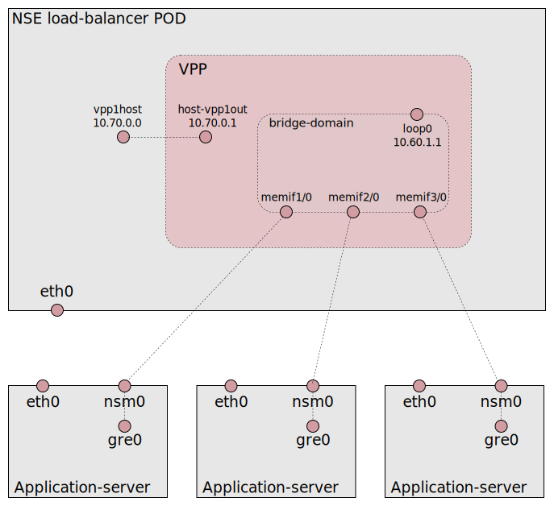

# VPP load-balancer

This is an example how the VPP load-balancer can be used to
load-balance external traffic between application-server (AS) PODs.

The intention is to use the load-balancer for the [CNF traffic separation
use case](https://github.com/cncf/cnf-testbed/issues/305).
To get traffic separation the external interface must be moved into the
NSE POD in some way. This is *not* included in this example.


Start in a cluster with NSM;
```
kubectl apply -f k8s/load-balancer.yaml
kubectl apply -f k8s/application-server.yaml
./scripts/check_load_balancer.sh > /dev/null
```


## Bridge domain setup

The "bridge-domain" example is used as a base to handle the
application-servers but is extended with a veth-pair used to get
traffic to VPP as described in the [VPP
tutorial](https://wiki.fd.io/view/VPP/Tutorial_Routing_and_Switching).





### Addresses and routing

The "10.60.1.0/24" address range is used for the bridge-domain (same
as the "bridge-domain" example). The `loop0` interface gives the local
VPP access to the bridge-domain and is assigned address
`10.60.1.1/24`. The application-servers will get 10.60.1.2, 10.60.1.3,...  The
veth-pair is assigned it's own tiny network; `10.70.0.0/31`.


A route to the bridge-domain range via `10.70.0.1` is setup in the POD
and a default route to `10.70.0.0` is setup inside VPP with;

```
ip route add 10.60.1.0/24 via 10.70.0.1
vppctl ip route add 0.0.0.0/0 via 10.70.0.0 host-vpp1out
```

With this setup external traffic can reach the application-servers
with appropriate routing.


### Checks and tests

Here are some tests you can do yourself to get a better understanding
of the bridge-domain setup.

Login to the load-balancer POD with `kubectl exec`;
```
kubectl exec -it -c load-balancer \
 $(kubectl get pods -l networkservicemesh.io/app=load-balancer -o name) bash
```

Check the VPP interfaces (narrowed);
```
# vppctl show int
Name               Idx    State
host-vpp1out                      1      up
local0                            0     down
loop0                             7      up
memif1/0                          2      up
memif2/0                          3      up
memif3/0                          4      up
```

Test to "ping" a application-server via vpp and from the pod;
```
# vppctl ping 10.60.1.4 repeat 1
116 bytes from 10.60.1.4: icmp_seq=1 ttl=64 time=23.9822 ms

Statistics: 1 sent, 1 received, 0% packet loss
## (test this twice. May fail the first time. Don't know why)
# ping -c1 -W1 10.60.1.4
PING 10.60.1.4 (10.60.1.4) 56(84) bytes of data.
64 bytes from 10.60.1.4: icmp_seq=1 ttl=63 time=17.8 ms

--- 10.60.1.4 ping statistics ---
1 packets transmitted, 1 received, 0% packet loss, time 0ms
rtt min/avg/max/mdev = 17.815/17.815/17.815/0.000 ms
```

Check the veth-pair;
```
# vppctl show int addr host-vpp1out
host-vpp1out (up):
  L3 10.70.0.1/31
# ip addr show dev vpp1host
13: vpp1host@vpp1out: <BROADCAST,MULTICAST,UP,LOWER_UP> ...
    inet 10.70.0.0/31 scope global vpp1host
       valid_lft forever preferred_lft forever
    ...
## (yes, 10.70.0.0 is a valid address)
```


## Application-Server setup

The application-server PODs are using an `alpine:latest` image with a
ConfigMap as init-script. This allows us to define start-up commands
in the [manifest](./k8s/lb-application-server.yaml);

```
apiVersion: v1
kind: ConfigMap
metadata:
  name: application-server-init
data:
  container-init: |
    ip addr add 10.2.2.0/24 dev lo
    ip link add gre0 type gre || true
    ip link set up dev gre0
    ip ro add 10.70.0.0/31 via 10.60.1.1
    ip rule add from 10.2.2.0/24 table 222
    ip ro add default via 10.60.1.1 dev nsm0 table 222
    nc -lk -p 5001 -e hostname
```

The VIP address is assigned to the loopback interface. The host must
have the VIP address since no NAT is made and packets arrive with the
VIP as destination.

The `gre0` interface must be created if needed and set "up". This is
because the VPP lb uses gre encapsulation.

A route is setup to the veth-pair to allow communication with the NSE
POD. This could be setup by NSM and is not really necessary for the
load-balancing function but good for testing.

A source policy route is added that directs replies from the VIP
address back to NSM.

The last `nc` command will block and will answer all incomming tcp
connects on port 5001 with it's host name (pod name).


## Load-balancer setup

The VIP is actually a range `10.2.2.0/24` and is defined as an
environment variable in the [manifest](./k8s/load-balancer.yaml).  The
load-balancer is setup with these commands (see
[nsehook.sh](./pod/bin/nsehook.sh));

```
vppctl lb vip $VIP_ADDRESS
vppctl lb conf ip4-src-address 10.60.1.1
vppctl lb as $VIP_ADDRESS 10.60.1.2
vppctl lb as $VIP_ADDRESS 10.60.1.3
vppctl lb as $VIP_ADDRESS 10.60.1.4
# ... more application-servers
```

Check the load-balancer status with;
```
vppctl show lb vips verbose
```


## External access

External traffic to the VIP address can be routed to the load-balancer
NSE POD through the normal K8s pod address on the K8s node where the
POD is executing. Example;

```
pod=$(kubectl get pods -l networkservicemesh.io/app=load-balancer -o name)
kubectl get $pod -o json | jq .spec.nodeName   # We must be on this node!
kubectl get $pod -o json | jq -r .status.podIP # This is the pod address
ip ro add 10.2.2.0/24 via $(kubectl get $pod -o json | jq -r .status.podIP)
```

Now we can finally test the load-balancing function. The application-servers has
`nc` setup to answer on port 5001 and we can use `nc` also for testing;

```
nc 10.2.2.33 5001 < /dev/null   # (repeat...)
```

You can setup routes to the VIP address via the K8s node and test
access from a cluster-external machine but that is out-of-scope for
this example.


## Implementation and trouble shooting

Hooks in bridge-domain progam is added that calls a program (script) on
startup and when a connection is added or removed.

The lb is setup using the [nsehook.sh](./pod/bin/nsehook.sh)
script. Check and alter as you see fit.

The commands executed are logged;

```
kubectl logs -c load-balancer \
 $(kubectl get pods -l networkservicemesh.io/app=load-balancer -o name) | grep NSE_HOOK
```


## Problems, observations and future plans

In no particular order.

* The [CNF use-case](https://github.com/cncf/cnf-testbed/issues/305)
  ensures network separation by bringing in an interface into the
  load-balancer NSE POD. That procedure is however not supported by
  NSM and there is no prefered procedure to do that dynamically
  AFAIK. At POD start-up this can be done by a CNI-plugin like
  "multus".

* For scaling and resilience there should be multiple
  load-balancers. The idea is that the ASs will connect to *one* of
  these via NSM. NSM is supposed to distribute the ASs between the
  load-balancers. This must be tested asap. Does it even work? The
  traffic impact when a load-balancer is removed/restarted/added must
  also be tested. In a perfect world the consistent hashing makes it
  possible for tcp connections to survive.

* NAT should be tested.

* How does the "gre0" interface works in PODs in different clouds?
